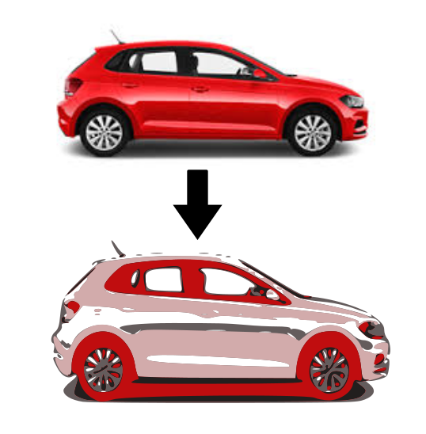
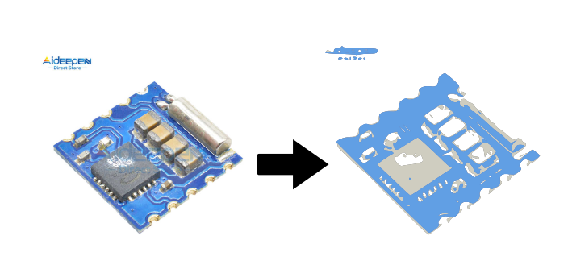

# jpg2svg

An attempt to convert colored JPG images to SVG. Similar to InkScape's bitmap tracing tool, but with the added functionality of automatically tracing the image multiple times in layers and automatically applying colors to these layers. 

### First Attempt Results
Images with higher contrast, and with white backgrounds produce better results:

